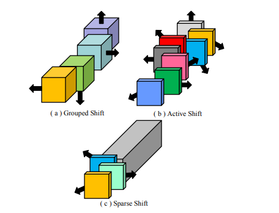

# All You Need Is a Few Shifts: Designing Efficient Convolutional Neural Networks for Image Classification

This repo is the official implementation of CVPR2019 paper "[All You Need Is a Few Shifts: Designing Efficient Convolutional Neural Networks for Image Classification](https://openaccess.thecvf.com/content_CVPR_2019/papers/Chen_All_You_Need_Is_a_Few_Shifts_Designing_Efficient_Convolutional_CVPR_2019_paper.pdf)".

## Paper introduction



The comparison of Sparse Shift Layer (SSL) with other shift operations applied to feature maps.


## Preparation

**Prerequistes**

- Python 3.6
- Pytorch 1.0
- CUDA 8.0 or higher

## Usage
### Data folds structure
  ```shell
  .ImageNetOrigin/
    └── train/
    |      ├── n01440764
    |      |      ├── n01440764_18.JPEG
    |      |      ├── n01440764_36.JPEG
    |      |      └── ...
    |      ├── n01443537
    |      └── ...
    └── val2/
           ├── n01440764
           |      ├── n01440764_18.JPEG
           |      ├── n01440764_36.JPEG
           |      └── ...
           ├── n01443537
           └── ...
  ```

### Train

```bash
bash train_imagenet.sh
```

### Eval

```bash
bash test_imagenet.sh
```

## Main Results
|Networks |MAdds|Prarms|Model Weights |Top-1| TrainLog | 
| ---- | -------| ----- |----|-----|-----|
|FE-Net 1.0x| 301M| 3.7M | [To-Be-Released]() | 73.6 \% | [log-file](./results/1x/FENet_imagenet.log) |
|FE-Net 1.0x + Autoaugment| 301M| 3.7M | [To-Be-Released]()  | 73.9 \% |[log-file](./results/1x+aug/FENet_imagenet.log)|
|FE-Net 1.375x|563M| 5.9M | [To-Be-Released]() | 75.7 \% |[log-file](./results/1.375x/FENet_imagenet.log)|
|FE-Net 1.375x + Autoaugment|563M| 5.9M | [To-Be-Released]() | 76.6 \% |[log-file](./results/1.375x+aug/FENet_imagenet.log)|

## Citation

Please consider citing our paper if you find it useful for your research.

```bash
@inproceedings{Chen2019ShiftNet,
  author = {Weijie Chen, Di Xie, Yuan Zhang, Shiliang Pu},
  title = {All You Need is a Few Shifts: Designing Efficient Convolutional Neural Networks for Image Classification},
  booktitle = {Proceedings of the IEEE/CVF Conference on Computer Vision and Pattern Recognition},
  year = {2019},
}
```

## License

This project is released under the [Apache 2.0 license](./LICENSE). Other codes from open source repository follows the original distributive licenses.

## Acknowledgement

We appreciate **Xianfeng Li** for transforming the source code from Caffe to Pytorch. If you have any problem about this work, please feel free to contact Xianfeng Li (lixianfeng6-at-hikvision.com) and Weijie Chen (chenweijie5-at-hikvision.com).
